# Munus - Technical Architecture (Mermaid)

## Full System Architecture

```mermaid
graph TB
    %% User Layer
    User[👤 User]
    
    %% Authentication Layer
    User -->|1. Login| Civic[🔐 Civic Auth<br/>Only SSO Provider]
    Civic -->|2. Creates| Wallet[💼 Embedded Wallet<br/>Auto-generated]
    
    %% Frontend Layer
    User -->|3. Interacts| Miniapp[📱 Next.js Miniapp<br/>Vercel]
    Miniapp -->|Auth| Civic
    Miniapp -->|Web3| Wagmi[⚡ Wagmi + Viem]
    
    %% Blockchain Layer
    Wagmi -->|Transactions| Base[⛓️ Base Sepolia<br/>Escrow Contract<br/>0x265B042A...]
    Base -->|Events| EventListener[📡 Event Listener]
    
    %% Messaging Layer
    User -->|4. Chat| XMTP[💬 XMTP Network<br/>Decentralized Messaging]
    XMTP -->|Messages| Agent[🤖 AI Agent<br/>GPT-4o + Agent SDK]
    Agent -->|Queries| Base
    Agent -->|Posts| XMTP
    EventListener -->|Receipts| Agent
    
    %% AI Layer
    Agent -->|Function Calling| Tools[🛠️ AI Tools]
    Tools -->|Contract Reads| Base
    Tools -->|getOpenJobs| Base
    Tools -->|getJobDetails| Base
    Tools -->|getMyJobs| Base
    
    %% Identity Layer
    Miniapp -->|Resolve Names| ENS[🏷️ ENS<br/>Ethereum L1]
    ENS -->|Names + Avatars| Miniapp
    
    %% Privacy Layer
    User -->|5. Sensitive Work| Calimero[🔒 Calimero<br/>Merobox]
    Calimero -->|Local Execution| Docker[🐳 Docker Container]
    Docker -->|Generates| Attestation[📝 Ed25519 Attestation]
    Attestation -->|CID Only| Base
    
    %% Styling
    classDef frontend fill:#3b82f6,stroke:#1e40af,color:#fff
    classDef blockchain fill:#10b981,stroke:#059669,color:#fff
    classDef messaging fill:#8b5cf6,stroke:#6d28d9,color:#fff
    classDef auth fill:#f59e0b,stroke:#d97706,color:#fff
    classDef privacy fill:#ef4444,stroke:#dc2626,color:#fff
    
    class Miniapp,Wagmi frontend
    class Base,EventListener blockchain
    class XMTP,Agent,Tools messaging
    class Civic,Wallet auth
    class Calimero,Docker,Attestation privacy
```

---

## Simplified User Flow

```mermaid
sequenceDiagram
    actor User
    participant Civic as 🔐 Civic Auth
    participant Miniapp as 📱 Miniapp
    participant Base as ⛓️ Base Escrow
    participant Agent as 🤖 AI Agent
    participant XMTP as 💬 XMTP Chat
    participant ENS as 🏷️ ENS
    
    %% Login Flow
    User->>Civic: 1. Login (Google/Apple)
    Civic->>User: Embedded Wallet Created
    User->>Miniapp: 2. Connect Web3 Wallet
    
    %% Create Job Flow
    User->>Miniapp: 3. Create Job (0.01 ETH)
    Miniapp->>ENS: Resolve creator name
    ENS->>Miniapp: vitalik.eth
    Miniapp->>Base: createJob() + funds
    Base->>Agent: JobCreated event
    Agent->>XMTP: Posts "🎯 New Job #0"
    
    %% Accept Job Flow
    User->>XMTP: 4. "I want to accept job 0"
    XMTP->>Agent: Message received
    Agent->>Base: Query job details
    Base->>Agent: Job info
    Agent->>XMTP: "Click to accept: [link]"
    User->>Miniapp: Opens link
    Miniapp->>Base: accept(0)
    Base->>Agent: JobAccepted event
    Agent->>XMTP: Posts "✅ alice.eth accepted!"
    
    %% Deliver & Release Flow
    User->>Miniapp: 5. Deliver work
    Miniapp->>Base: deliver(hash, CID)
    Base->>Agent: JobDelivered event
    Agent->>XMTP: Posts "📦 Job delivered!"
    
    User->>Miniapp: 6. Release payment
    Miniapp->>Base: release(0)
    Base->>User: Transfer ETH
    Base->>Agent: JobReleased event
    Agent->>XMTP: Posts "💰 Payment released!"
```

---

## Data Flow Architecture

```mermaid
flowchart LR
    %% Input Sources
    UserInput[User Input]
    ChatMsg[Chat Messages]
    ContractEvent[Contract Events]
    
    %% Processing Layer
    UserInput --> Miniapp[📱 Miniapp]
    ChatMsg --> Agent[🤖 AI Agent]
    ContractEvent --> EventListener[📡 Event Listener]
    
    %% Blockchain Layer
    Miniapp --> |Write Txs| Base[(⛓️ Base<br/>Escrow Contract)]
    Agent --> |Read State| Base
    EventListener --> |Monitor| Base
    
    %% Response Layer
    Base --> |Events| EventListener
    EventListener --> |Receipts| XMTP[💬 XMTP]
    Agent --> |Messages| XMTP
    Miniapp --> |Updates| UI[🖥️ User Interface]
    
    %% Identity Resolution
    UI --> |Resolve| ENS[🏷️ ENS L1]
    ENS --> |Names/Avatars| UI
    
    %% AI Processing
    Agent --> |Function Call| GPT4[🧠 GPT-4o]
    GPT4 --> |Tool Use| Tools[🛠️ Contract Tools]
    Tools --> Base
    
    style Miniapp fill:#3b82f6
    style Agent fill:#8b5cf6
    style Base fill:#10b981
    style XMTP fill:#ec4899
    style ENS fill:#f59e0b
```

---

## Component Architecture

---

## Tech Stack Layers

---

## Bounty Integration Map

---

## How to Use These Diagrams

### In Markdown/Docs:
Just copy the mermaid code blocks directly into your markdown files. GitHub, GitLab, and most doc tools render them automatically.

### In Slides (PowerPoint, Google Slides):
1. Go to https://mermaid.live/
2. Paste the mermaid code
3. Export as PNG or SVG
4. Insert into your slides

### In Notion/Obsidian:
Both support mermaid natively - just paste the code blocks.

### Online Editor:
- https://mermaid.live/ - Best for editing and exporting
- https://mermaid.ink/ - Quick PNG generation

---

## Simplified One-Liner Diagrams

### Super Simple Flow:

### Bounty Focus:

---

Choose the diagram that fits your needs and export it! 🎨

